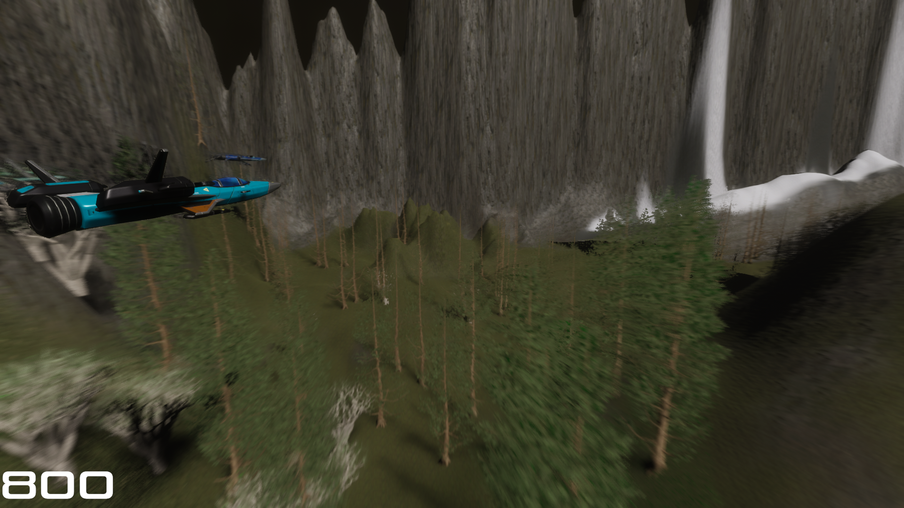
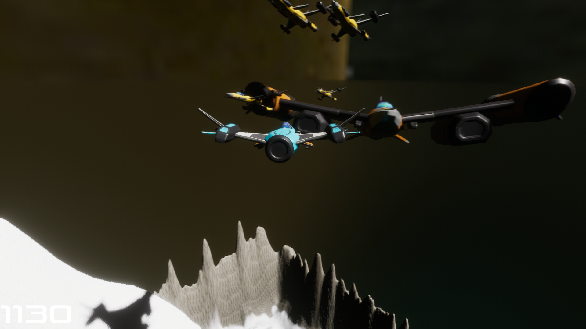
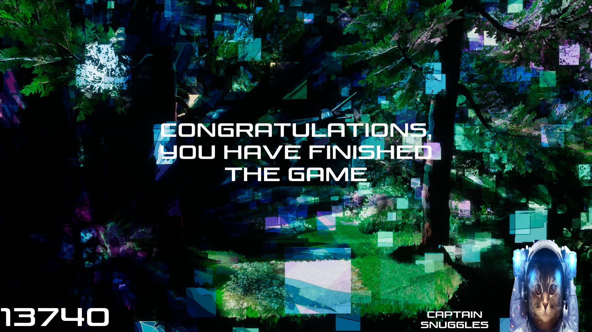

<!-- GAME PROJECT TITLE -->
# Argon-Assault---Game
Game created for study purposes by Matheus Soares Martins, and is was created to test high definition graphics in unity, using HDRP, ShaderGraph and Post Processing with the new Unity Input System. 
In this game you control a ship in a place where its being invaded by aliens, so you must protect the place from the invasion destroying was much alien ships as possible, while being
guided by Captain Snuggles.
 

This game was made to be played by one player, and it uses the commonly used input for games.
 

Player controls 
- FPS control: 
W - Makes the player ship goes up 
A - Makes the player ship goes to the left 
S - Makes the player ship goes down 
D - Makes the player ship goes to the right 
Left Mouse Click - Shoots laser projectiles (you can hold it too) 

- Original control: 
Up arrow - Makes the player ship goes up 
Left arrow - Makes the player ship goes to the left 
Down arrow - Makes the player ship goes down 
Right arrow - Makes the player ship goes to the right 
Space - Shoots laser projectiles (you can hold it too) 

Other controls 
Esc - Closes the game 
F11 - Toggle between fullscreen and windowed mode. 
******************************************************************************

 

# Screenshots
<!-- GAME PROJECT IMAGES -->

# <!-- GAME PROJECT BUILDS -->
# Game download 
## Windows: https://mega.nz/folder/gJkEUbLT#1eIrRfLQ4pw5X60VDZ12eQ
## Mac: https://mega.nz/folder/wYMUURRB#l9687ReX3OEoJUw0ZtKg_Q
## Linux: https://mega.nz/folder/0IEk1DZb#LSutduxv8q-O3qE6Wprr_g
